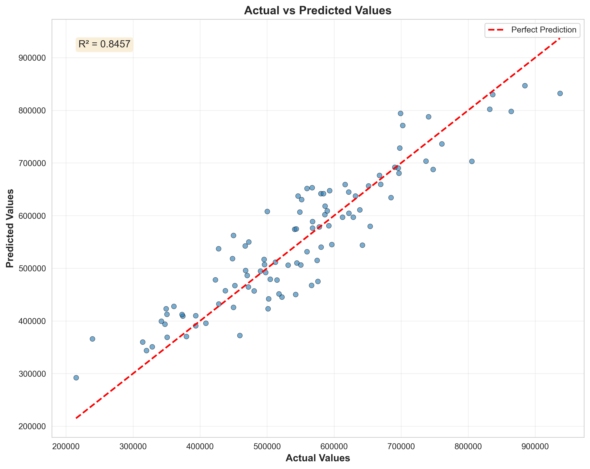
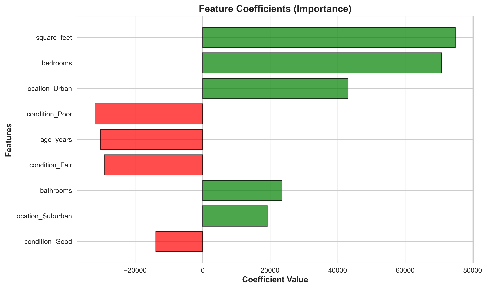

# 📈 Linear Regression Template: Predicting Continuous Values

## 🚀 Project Overview
**Developed a reusable Python template for solving regression problems, the most common task in machine learning for predicting continuous values (e.g., sales figures, housing prices, stock values).**

This template implements Linear Regression, the foundational algorithm for statistical modeling. It establishes a "line of best fit" to model the relationship between independent features and a dependent target variable. Key performance metrics (R-squared, MSE, RMSE) are automatically calculated to provide a quantitative measure of model fit.

The template automates the full pipeline and includes critical diagnostic visualizations to ensure the model is unbiased and reliable.

---

## 📊 Key Results & Visualizations

### 1. Actual vs. Predicted Values
This plot visually compares the model's predictions against the true, actual values from the test set, with a 45-degree line indicating a perfect fit. Points closer to this line signify higher accuracy.

### 2. Residuals Plot: Model Diagnostics
An essential diagnostic tool! This plot of the model's errors (residuals) against predicted values helps to check for critical assumptions like homoscedasticity and detect hidden patterns, ensuring the model's reliability and unbiasedness.

### 3. Feature Importance/Coefficients
Understanding which features most influence the target variable is crucial. This visualization displays the relative importance or coefficients of each feature, highlighting their impact on the prediction.

---

## 🛠 Tech Stack
* **Language:** Python 3.9+
* **Modeling:** Scikit-learn (LinearRegression)
* **Data Manipulation:** Pandas, NumPy
* **Visualization:** Matplotlib, Seaborn

---

## 🔒 Source Code Access
*This repository serves as a showcase of the project's methodology and results.*

Due to specific project requirements (or data sensitivity), the full source code for this template is maintained in a private repository. However, a detailed code overview and architecture discussion are available upon request for interested parties.
